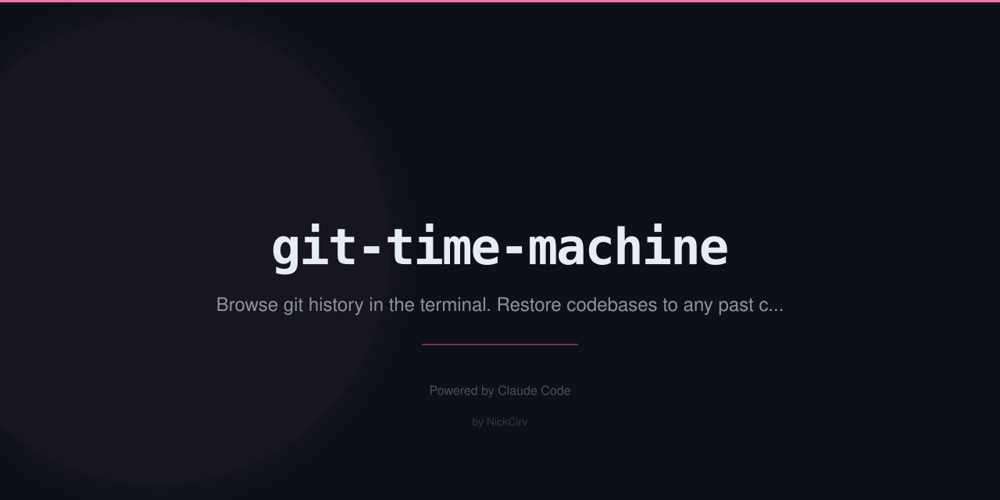

# git-time-machine

> Interactively browse git history and restore your codebase to any past commit — with preview, diff, and safety checkpoints.

Zero external dependencies. Pure Node.js ES modules. Works anywhere git does.

---

## Install

```bash
npm install -g git-time-machine
```

Or run without installing:

```bash
npx git-time-machine
```

---

## Usage

```
gtm [file]                    Browse all commits (or commits touching <file>)
gtm --date "2 weeks ago"      Jump to nearest commit before date
gtm --search "bug fix"        Filter commits by message
gtm --restore <hash>          Non-interactive restore to commit
gtm checkpoints               List saved checkpoint stashes
```

---

## TUI Keys

| Key | Action |
|-----|--------|
| `↑` / `k` | Navigate up |
| `↓` / `j` | Navigate down |
| `PgUp` / `PgDn` | Jump 10 commits |
| `Enter` / `p` | Toggle commit preview |
| `[` / `]` | Scroll preview up/down |
| `Space` | Restore to selected commit |
| `/` | Search commits |
| `g` / `G` | Go to top/bottom |
| `Esc` | Clear status message |
| `q` / `Ctrl+C` | Quit |

---

## Features

### Interactive TUI browser (`gtm`)
- Commit list: hash, date, author, message
- Arrow keys to navigate, `Enter` to toggle preview
- Preview shows file tree at that commit + diff stat
- `Space` to restore — prompts for confirmation before doing anything
- Stashes current changes with a `gtm-checkpoint` label before restoring
- Restores via `git checkout <hash>` (detached HEAD) with a warning

### Browse history for a specific file (`gtm <file>`)
- Shows only commits that touched that file
- Preview shows the file content at each commit
- Restore just that file: `git checkout <hash> -- <file>`

### Jump to a date (`gtm --date "2 weeks ago"`)
- Finds the nearest commit before the given date
- Accepts any date string that `git log --before` accepts

### Search commits (`gtm --search "bug fix"`)
- Filters commits by message (case-insensitive)
- Combines with `--date` for targeted lookups

### Non-interactive restore (`gtm --restore <hash>`)
- Stashes current changes, then checks out the given commit
- Shows the branch name to return to

### List checkpoints (`gtm checkpoints`)
- Lists all stash entries created by git-time-machine
- Each one is labelled `gtm-checkpoint: before-restore-to-<hash>`

---

## Safety

- Never silently discards work — always stashes before any restore
- Detached HEAD warning shown before full-repo restores
- File-only restores are scoped and reversible
- Confirmation prompt required before every restore

---

## Requirements

- Node.js 18+
- Git 2.x+
- Zero npm dependencies

---

## License

MIT
